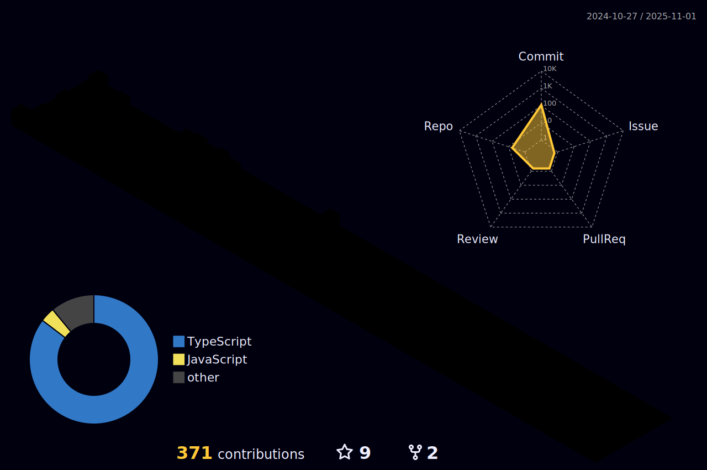

  <!-- Banner Image -->
  
  
  

<!--   my-ticker -->    

## Languages & Skills
<!--   my-skils -->
| Domain | Technologies |
| --- | --- |
| **Languages** |         |
| **Backend** |       |
| **Frontend** |       |
| **Cloud** |    |
| **Database** |     |
| **Tools** |         |
| **IDE / Editors** |    |

